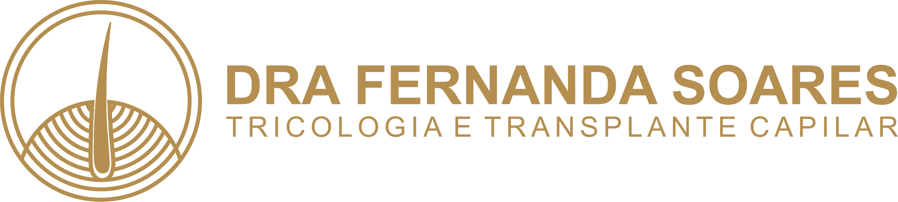

<div align="center">

  <!-- Logo da Dra. Fernanda Soares -->
  

  # 🩺 Dra. Fernanda Soares — Landing Page Médica

  **Tricologia Médica & Transplante Capilar de Alta Precisão**  
  *Atendimentos na Clínica Raffe em Montes Claros & Pirapora (MG)*

  [Demonstração da Aplicação](https://www.drafernandasoares.com.br) · [Reportar Bug](https://github.com/igorsposito/dra-fernanda-soares/issues)

  <br />

  <!-- Badges do Projeto -->
  
  
  
  

</div>

---

## 📌 Sobre o Projeto

Landing page médica de alta performance desenvolvida para a **Dra. Fernanda Soares**, especialista em Tricologia Avançada, diagnóstico de patologias do couro cabeludo e transplante capilar. 

O projeto foi projetado do zero com foco em **autoridade visual, elegância, carregamento ultra-rápido e conversão direta via WhatsApp**.

---

## ✨ Destaques & Funcionalidades

- 📱 **Design 100% Responsivo**: Layout otimizado para celulares, tablets e monitores desktop.
- 🎯 **Hero Section com Enquadramento Dinâmico**: Foto com gradiente de transparência de baixo para cima (`0deg`) e ajuste fino de `object-position` para alinhamento perfeito do rosto no mobile.
- 💬 **Agendamento Inteligente**: Botão de conversão flutuante e botões com rastreio de origem de mensagens para o WhatsApp.
- ⚡ **Accordion Fluido no FAQ**: Dúvidas frequentes com animação CSS suave via `grid-template-rows`.
- 🔍 **SEO & Open Graph (OG)**: Metadata completa para pré-visualização enriquecida ao compartilhar o link no WhatsApp, Instagram e redes sociais.
- 🎨 **Pruning Responsivo**: Rodapé e cabeçalho otimizados para evitar excesso de informação em telas pequenas.

---

## 🛠️ Tecnologias Utilizadas

- **[Next.js](https://nextjs.org/)** — Framework React para alta performance e rendering otimizado.
- **[React](https://react.dev/)** — Construção de interface modular e reativa.
- **CSS Modules** — Estilização isolada sem conflitos globais de classe.
- **[Lucide React](https://lucide.dev/)** — Ícones modernos em formato SVG leve.
- **[Lenis / SmoothScroll](https://lenis.darkroom.engineering/)** — Navegação com rolagem suave.

---

## 🚀 Como Executar o Projeto Localmente

1. **Clonar o repositório:**
   ```bash
   git clone [https://github.com/igorsposito/dra-fernanda-soares.git](https://github.com/igorsposito/dra-fernanda-soares.git)